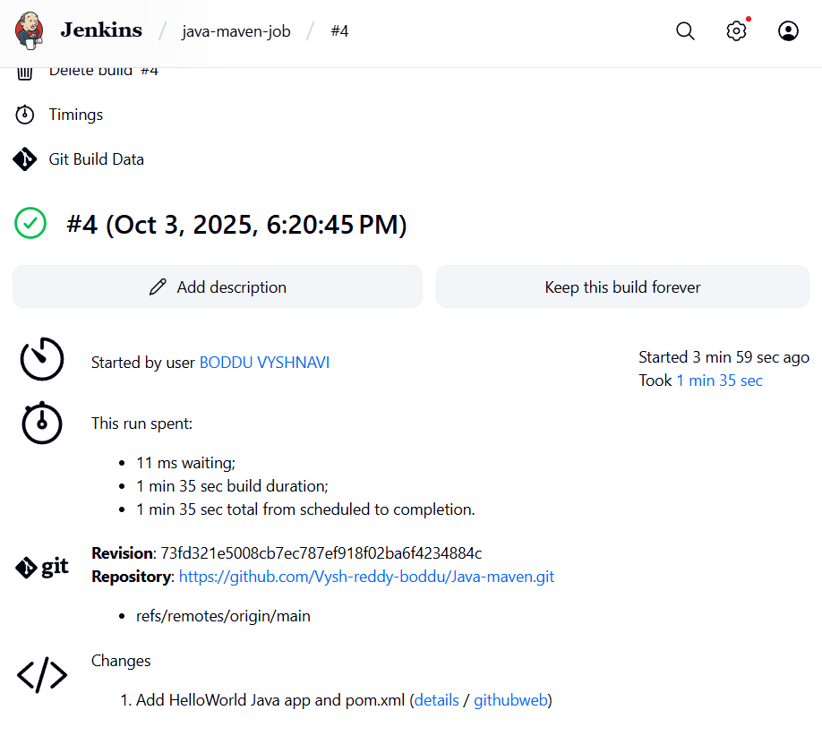

# Hello Java Maven Project

This is a simple **Java HelloWorld application** built using **Maven** and **Jenkins** CI/CD.

## Project Structure

src/
main/
java/
HelloWorld.java
pom.xml


## Build & CI/CD

The project is configured to build using **Maven**. A **Jenkins Freestyle job** is used to run `clean package`.

### Jenkins Build Screenshot



## How to Build Locally


1. Make sure **Java JDK 8 or 11** is installed.  
2. Make sure **Maven** is installed.  
3. Run the following command:

```bash
mvn clean package

